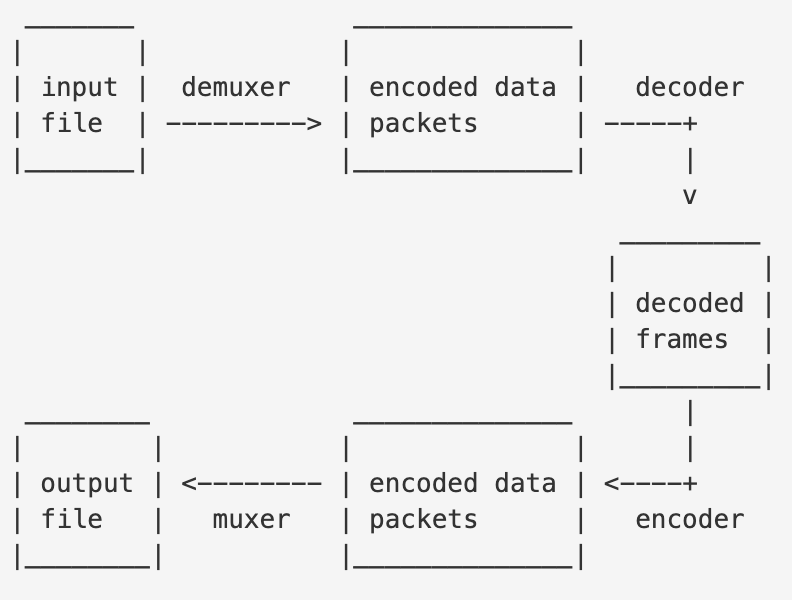
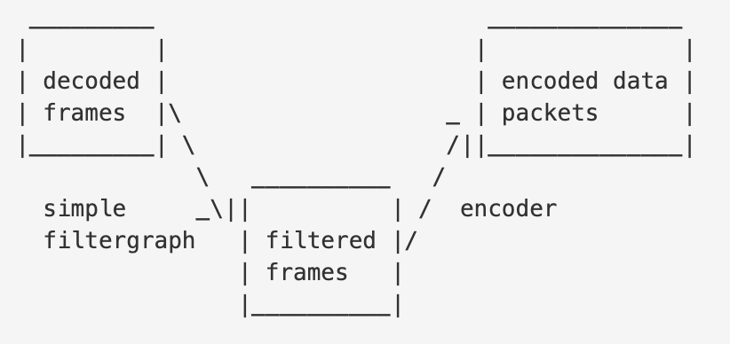

mobile-FFmpeg 自定义打包sdk
=========================

简介自定义打包FFmpeg的一般思路和流程。**建议**：有任何疑问可查看 [原项目文档](https://github.com/tanersener/mobile-ffmpeg)、[wiki](https://github.com/tanersener/mobile-ffmpeg/wiki)、[issues](https://github.com/tanersener/mobile-ffmpeg/issues)

环境配置
------

Mac环境变量配置ndk、Cmake（若没有需要先安装）:
```
export ANDROID_NDK_ROOT=/Users/your-user-name/Library/Android/sdk/ndk/21.3.6528147
export CMAKE_ROOT=/Applications/CMake.app/Contents/bin/
export PATH=$CMAKE_ROOT:$PATH
```

安装`nasm`
```
brew install nasm
```

安装`pkg-config`
```
brew install pkg-config
```

**注**：build过程中可能会出现其他状况，一般按照[Logs](https://github.com/tanersener/mobile-ffmpeg/wiki/Logs)说明查看本地生成的`build.log`都能解决。

**如果只想验证本地环境是否配置成功，可直接查看第三步：`执行打包命令`**

Step1: 确认流程
-------------

以水印功能为例，按照[ffmpeg官方文档](https://ffmpeg.org/ffmpeg-all.html#Detailed-description)的描述，水印功能涉及到5个模块：

编解码：



过滤器：



1. demuxer
2. decoder
3. encoder
4. muxer
5. filter

Step2: 配置支持的模块
-------------------

以decoder为例，FFmpeg支持数目200+，有可能占用几百K甚至1M+的体积（可用`sh configure --list-encoders`查看）
```sh
cd src/ffmpeg
sh configure --help
sh configure --list-encoders
```

上述所有模块，可以根据项目需要，只启用需要的模块。具体方法：在`build/android-ffmpeg.sh`文件中，在`./configure`末尾追加配置
```sh
    --disable-everything \
    --enable-decoder=h264,aac,mpeg4,png,bmp,jpeg2000,jpegls,mjpeg,mjpegb,smvjpeg,h264_mediacodec \
    --enable-encoder=libx264,aac,libx264rgb,libx265,mpeg4,png,bmp,jpeg2000,jpegls,mjpeg,mjpegb,smvjpeg,gif \
    --enable-demuxer=mov,image2,h264,mpegts \
    --enable-muxer=mp4,image2,h264,mpegts,gif,segment \
    --enable-filter=format,overlay,scale,scale2ref,null \
```

Step3: 打包
-----------

项目原作者打包使用的脚本是`tools/release`目录下的`android.lts.sh`、`android.sh`，对应输出 [packages](https://github.com/tanersener/mobile-ffmpeg#21-packages)。自定义打包则依葫芦画瓢，主要增加了2个文件：

1. `android-watermark.sh`: 打包主流程
2. `release.github.template.gradle`: 输出sdk到 [Atlasv/android-libs](https://github.com/AtlasXV/android-libs/packages/539956)

**执行打包**

升级版本号：`android/app/src/main/cpp/mobileffmpeg.h`，4.4.8-->4.4.9(示例)：
```c++
#define MOBILE_FFMPEG_VERSION "4.4.8"
```

运行打包命令：
```sh
cd tools/release
sh android-watermark.sh 449 4.4.9
```

调试
---
1. 在`android-watermark.sh`末尾gradle语句的`clean publish` 改成`clean publishMavenLocal`，可使用mavenLocal()仓库调试
2. 本地调试阶段不需要打包所有CPU架构的so，可在`android-watermark.sh`中的`CUSTOM_OPTIONS`参数前追加`--disable-arm-v7a --disable-arm-v7a-neon --disable-x86 --disable-x86-64`，只打包`arm64-v8a`架构，大大减少build周期。

使用
---
```
implementation "com.atlasv.android:mobile-ffmpeg-watermark:4.4.8"
```

其中artifactId（mobile-ffmpeg-watermark）由`android-watermark.sh`的`-PreleaseProject`定义。


